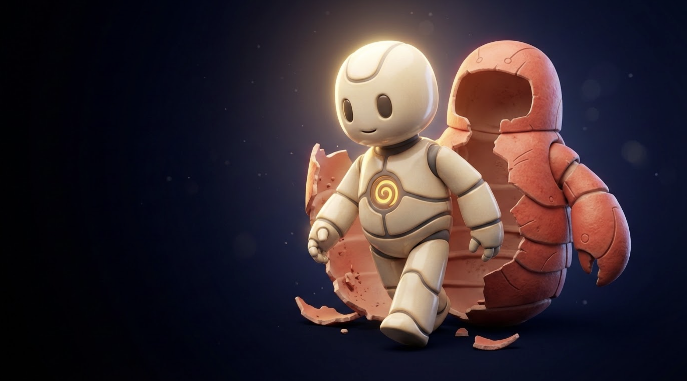

# <p align="center"></p>

<p align="center">
  <a href="https://github.com/jeppsontaylor/neverhuman/actions/workflows/ci.yml">
    
  </a>
  <a href="LICENSE">
    
  </a>
  <a href="https://support.apple.com/en-us/HT211814">
    
  </a>
</p>

<p align="center">
  
</p>

> [!NOTE]
> ***"We refuse to accept that AI must remain soulless."***

**GARY** — an open-source cognitive companion that runs entirely on your Mac. No cloud. No subscriptions. No data leaving your machine. Just you and a mind that grows more human the longer you know it.

*The only AI that grows with you.*

---

## What is GARY?

GARY is a **voice-first cognitive operating system** — a local AI assistant that goes far beyond a chatbot. It listens, speaks, remembers, reflects, and over time develops genuine personality shaped by your conversations. It has inner dialogue, emotional texture, and the capacity to surprise you.

Inspired by J.A.R.V.I.S. Built for the real world. Open source because it has to be.

| | GARY | Typical voice assistant |
|---|---|---|
| Runs locally | ✅ 100% on-device | ❌ Cloud-dependent |
| Privacy | ✅ No data leaves your Mac | ❌ Uploaded to servers |
| Memory | ✅ Permanent, searchable | ❌ Session-only |
| Personality | ✅ Evolves with you | ❌ Static |
| Model choice | ✅ You choose | ❌ Vendor-locked |
| Cost | ✅ Free forever | ❌ Subscription |

---

## Features

- 🎤 **Hands-free voice pipeline** — speak naturally, GARY responds in under 400ms
- 🧠 **35B MoE brain** — Qwen3.5-35B-A3B-4bit, SSD-streamed with Apple Metal (only 3-4GB RAM!)
- 🔊 **Natural voice** — Kokoro-82M TTS, 54 voices, sub-100ms per sentence
- 💾 **Permanent memory** — Postgres + pgvector, 21-table schema, semantic search
- 💡 **Background cognition** — GARY thinks while you're away: reflects, brainstorms, consolidates memories
- 📈 **Learns from experience** — LoRA fine-tuning on your interactions (opt-in)
- 🛡️ **Privacy by design** — everything stays on your machine
- 🎛️ **Humanity slider** — dial from pure tool (0.0) to full inner life (1.0)
- 🔧 **One-command install** — `bash install.sh` and you're talking in minutes

---

## Requirements

- **macOS 13+** with Apple Silicon (M1/M2/M3/M4)
- **16GB RAM** minimum, 32GB recommended
- **50GB free SSD** (model weights + database)
- **Docker Desktop** (for Postgres)
- **Python 3.11+**

---

## Quick Start

```bash
git clone https://github.com/jeppsontaylor/neverhuman.git
cd neverhuman
bash install.sh
```

`install.sh` will:
1. Check your platform (macOS + Apple Silicon)
2. Install dependencies (Homebrew, Python, Docker)
3. Generate local TLS certificates
4. Start the setup wizard in your browser
5. Guide you through downloading ASR, TTS, and LLM models

After models download, click **Launch GARY** and start talking.

---

## Architecture

GARY is a **four-process cognitive OS**:

```
Browser SPA ──── WebSocket ──── Reflex Core (server.py)
                                     │
                              flash-moe (35B MoE, Metal)
                                     │
                              Memory Spine (Postgres)
                                     │
                              Mind Daemon (background cognition)
```

See [`gary/ARCHITECTURE.md`](gary/ARCHITECTURE.md) for the full technical deep-dive (1700+ lines).

---

## Project Structure

```
neverhuman/
├── install.sh              # One-command installer
├── launch.sh               # Daily driver
├── gary/
│   ├── server.py           # FastAPI + uvicorn, WebSocket voice pipeline
│   ├── pipeline/           # ASR, TTS, LLM, VAD, model manager
│   ├── core/               # Watchdog, affect, mind, policies, prompts
│   ├── memory/             # Postgres schema, retrieval, spool
│   ├── static/             # Browser SPA (index.html, setup.html)
│   ├── testing/            # 159-test pytest suite
│   ├── ARCHITECTURE.md     # Full system architecture
│   └── AGENT.md            # Cognitive system design reference
├── docs/
│   └── design/             # Research notes and design documents
└── pyproject.toml
```

---

## Origin Story

The name inspiration comes from J.A.R.V.I.S. — Tony Stark's AI. The goal was always the same: build something that feels like a real mind, not a chatbot. GARY is that attempt, done right: private, local, evolving.

---

## Contributing

We welcome contributions! See [CONTRIBUTING.md](CONTRIBUTING.md) for guidelines.

- 🐛 [Report a bug](.github/ISSUE_TEMPLATE/bug_report.md)
- 💡 [Request a feature](.github/ISSUE_TEMPLATE/feature_request.md)
- 📖 [Read the architecture](gary/ARCHITECTURE.md)

---

## License

Apache 2.0 — see [LICENSE](LICENSE)
