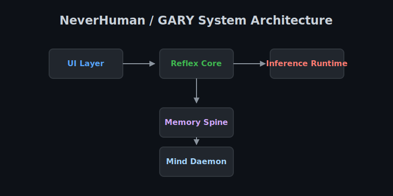

# <p align="center"></p>

<p align="center"><strong>NeverHuman</strong></p>

<p align="center"><strong>GARY is a private, voice-first cognitive assistant for Apple Silicon.</strong><br>
Persistent memory, local inference, and real-time voice interaction — fully on-device, with no required cloud dependency.</p>

<p align="center">
  <a href="LICENSE">
    
  </a>
  <a href="https://support.apple.com/en-us/HT211814">
    
  </a>
  <a href="docs/benchmarks.md">
    
  </a>
</p>

<p align="center">
  <a href="#quick-start">Get Started</a> ·
  <a href="#demo">Demo</a> ·
  <a href="#architecture-overview">Architecture</a> ·
  <a href="docs/benchmarks.md">Benchmarks</a> ·
  <a href="CONTRIBUTING.md">Contributing</a>
</p>

---

## At a glance

| | |
|---|---|
| **Runs on** | Apple Silicon Macs |
| **Core experience** | Local voice conversation, memory, retrieval, reflection |
| **Privacy model** | Fully on-device, no required cloud dependency |
| **Designed for** | Long-lived interaction, personalization, and local ownership |
| **Status** | Alpha / Developer Preview |

---

## What makes it different

- **Private by default** — runs entirely on your Mac; your data stays on your machine.
- **Built for Apple Silicon** — optimized for efficient local inference with SSD-to-Metal streaming.
- **Persistent memory** — stores and retrieves relevant context over time.
- **Designed to adapt** — built for long-lived interaction, reflection, and personalization.

---

## Demo

> **See GARY running locally on Apple Silicon.**  
> The assets below are placeholders until final product media is available.


*GARY running locally with real-time voice interaction.*

<details>
<summary><b>View interface screenshots</b></summary>

<br>


*Natural voice interaction with low-latency turn-taking.*


*Inspect, search, and retrieve local memory.*

</details>

---

## Who this is for

- Mac users who want a private, on-device AI assistant.
- Engineers building long-lived local voice agents.
- Researchers exploring memory, reflection, and adaptation in interactive systems.
- Open-source contributors interested in local inference, retrieval, and agent architecture.
- People who want ownership, inspectability, and zero subscription dependency.

---

## Quick Start

### Try it now (for users)

```bash
git clone https://github.com/jeppsontaylor/neverhuman.git
cd neverhuman
bash install.sh
```

First-time setup may take several minutes depending on model downloads and network speed.

`install.sh` handles dependency setup, local services, and the initial configuration flow. See [Getting Started](docs/getting-started.md) for a full walkthrough.

### Develop locally (for engineers)

See the [Local Development Guide](docs/getting-started.md) for:

* environment setup
* dependency installation
* backend startup via `gary/server.py`
* frontend binding on `localhost:8000`
* development workflow and debugging tips

### Hardware compatibility

| Hardware Tier | Status | Recommended Experience |
|---|---|---|
| **M1 / M2 / M3 (Base, 16GB)** | Supported | Basic (Voice + Reflection) |
| **M2 Pro / M3 Pro (32GB)** | Supported | Strong (Rapid Turn-taking) |
| **M3 Max / M4 Max (64GB+)** | Supported | Excellent (Maximum Parameter Models) |

---

## What GARY is

GARY is a voice-first local cognitive assistant built around persistent memory and long-lived interaction. Rather than behaving like a stateless chat window, GARY is designed to:

* **Listen** through a low-latency voice activity and speech pipeline
* **Speak** with fast local text-to-speech
* **Remember** through durable local memory and vector retrieval
* **Retrieve** context from structured Postgres-backed storage
* **Reflect** in the background while idle
* **Adapt** by consolidating patterns from repeated interaction

### GARY vs. Cloud Assistants

| Feature | GARY | Typical Cloud Assistant |
|---|---|---|
| **Execution** | Entirely local (Apple Silicon) | Remote servers |
| **Memory** | Persistent, accessible vector DB | Ephemeral or opaque |
| **Privacy** | 100% on-device | Data processed centrally |
| **Ownership** | Fully inspectable Postgres tables | Proprietary black box |
| **Cost** | Zero recurring subscriptions | Monthly fees |

---

## Why local matters

Running GARY on your own Mac means lower latency, durable personalization, predictable cost, and full control over memory and runtime behavior. The goal is not just to replicate a cloud assistant locally, but to make a more personal and inspectable one possible.

---

## Status and roadmap

**Current maturity:** Alpha / Developer Preview

The core loop is functional today, but APIs, UX, and runtime behavior are still evolving.

### What works today

* Real-time voice input and output
* On-device inference and local memory vectorization
* Persistent local memory retrieval
* Background reflection and daemon tasks
* Model selection during setup

### On the roadmap

* Deeper long-term adaptation and personalization
* Richer personality shaping via the Humanity Slider
* Tool and plugin architectures
* Multimodal input, including image and video workflows

[View the full roadmap](ROADMAP.md)

---

## Why SSD-to-Metal streaming matters

Large local models often require more memory than consumer Macs can comfortably dedicate in RAM alone. NeverHuman reduces that pressure by streaming model weights efficiently from SSD into Apple’s Metal stack, making larger local runtimes more practical on M-series machines.

For implementation details, see the [Inference Runtime Guide](docs/inference-runtime.md).

---

## Architecture overview



```mermaid
flowchart LR
  subgraph Client["Client (Browser)"]
    UI["index.html UI"]
    AW["processor.js AudioWorklet\n16kHz mic chunks"]
    UI <--> AW
  end

  subgraph Reflex["Reflex Core (gary/server.py)"]
    WS["WebSocket /ws/gary"]
    VAD["VAD + turn segmentation"]
    ASR["ASR (Qwen3-ASR / MLX)"]
    TURN["Turn classifier\nSNAP/LAYERED/DEEP"]
    CPK["Context Pack v2"]
    LLM["LLM client (SSE)"]
    TTS["TTS (Kokoro ONNX)\n+ parallel queue"]
    LOG["Session + persistent logs"]
    WS --> VAD --> ASR --> TURN --> CPK --> LLM --> TTS --> WS
    Reflex --> LOG
  end

  subgraph Runtime["Inference Runtime"]
    MOE["flash-moe\nQwen3.5-35B MoE"]
  end

  subgraph Memory["Memory Spine"]
    SPOOL["Spool (crash-safe JSONL)"]
    DB["asyncpg pool"]
    PG[("Postgres + pgvector")]
    RET["Fusion retrieval"]
    SPOOL --> DB --> PG
    RET --> DB
  end

  subgraph Mind["Mind Daemon"]
    MINDLOOP["Mind loop + pulse scoring"]
    MINDAPI["apps/mindd sidecar (:7863)"]
    LANES["9 cognitive lane prompts"]
    MINDLOOP --> MINDAPI --> LANES
  end

  AW --> WS
  LLM -- "SSE" --> MOE
  CPK --> RET
  MINDLOOP --> DB
  MINDLOOP --> WS
  WS --> UI
```

For an expanded, subsystem-by-subsystem diagram and role map, see [`docs/system-network-diagram.md`](docs/system-network-diagram.md).  
For the deep architecture upgrade proposal focused on “most human” behavior and autonomous learning, see [`docs/design/humanity-level-up-plan.md`](docs/design/humanity-level-up-plan.md).

### Core architecture

1. **UI layer** — browser-based interface and setup flow
2. **Reflex core** — FastAPI orchestration and state handling
3. **Inference runtime** — local ASR, TTS, and LLM execution
4. **Memory spine** — durable Postgres + pgvector storage and retrieval
5. **Mind daemon** — background reflection, consolidation, and event processing

[Read the full architecture documentation](ARCHITECTURE.md)

---

## Features

### Interaction

* Real-time conversational pipeline
* Natural local text-to-speech
* Low-latency turn-taking and context retention

### Memory

* Searchable persistent memory
* Semantic retrieval
* Structured relationship storage

### Runtime

* Fully on-device model execution
* Apple Silicon-optimized runtime
* High-speed SSD-to-Metal streaming

### Personalization

* Memory growth over time
* Adaptation from repeated interaction
* Configurable personality boundaries

### Privacy

* No required cloud dependency
* Local-only data processing
* Inspectable storage and runtime behavior

---

## Benchmarks

See [Benchmarks.md](docs/benchmarks.md) for full methodology, hardware details, and test configuration.

| Metric               | M1 Max | M2 Pro | M3 Max |
| :------------------- | :----: | :----: | :----: |
| Voice Response (TTS) | <140ms | <120ms | <100ms |
| First Token (LLM)    | <600ms | <450ms | <400ms |
| Memory Retrieval     |  <80ms |  <60ms |  <50ms |
| RAM Footprint        | ~4.5GB |  ~4GB  |  ~4GB  |

*Benchmark results vary by model choice, quantization, prompt length, thermal state, and background workload.*

---

## Reliability, trust, and FAQ

**Project status:** Active alpha. Standard voice interaction is stable in current builds, though heavy concurrent reflection workloads may still reduce responsiveness on lower-spec M1 systems.

* **[Privacy & Telemetry](docs/privacy-and-telemetry.md)** — telemetry is off by default; no third-party tracking.
* **[Security Policy](SECURITY.md)** — vulnerability reporting and security process.
* **[FAQ](docs/faq.md)** — common questions on setup, models, storage, Docker, and runtime behavior.

---

## Join the project

We’re building a private, local, voice-first cognitive assistant for Apple Silicon. If you care about local AI, memory systems, voice UX, inference performance, or making computing feel more personal, we’d love your help.

### Contributor lanes

* `voice` — ASR, TTS, VAD, and realtime interaction
* `memory` — retrieval, storage, and consolidation systems
* `runtime` — Metal inference, orchestration, and performance
* `ui` — conversation, setup, and inspection interfaces
* `docs` — architecture, onboarding, and project communication
* `benchmarks` — evaluation, profiling, and performance reporting

See the [Contributing Guide](CONTRIBUTING.md) to get started, or pick up any issue labeled `good first issue` or `help wanted`.

We especially welcome contributors who enjoy turning ambitious systems into reliable, usable software.
